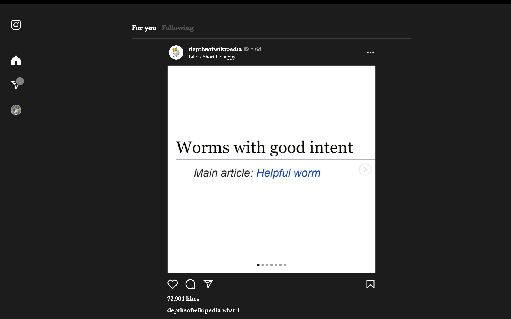

I've started playing around with the Boost feature of [Arc Browser](https://arc.net/). Here's an [invite](https://arc.net/gift/55fb6b96) if you haven't tried it out yet.

This post is to serve as a gallery of my favourite Boosts, including my own creations.

## [green pea are.na skin](https://arc.net/boost/C05314CD-FE01-43E2-8D5C-D4B15BB4879B)
My personal garden flavouredd skin for [are.na](https://are.na).

## [No YouTube Shorts Please](https://arc.net/boost/C05314CD-FE01-43E2-8D5C-D4B15BB4879B)
Simple as that. Improves YouTube by 100%. 

I also recommend using the Chromium extension [Rabbit Hole for YouTube](https://chrome.google.com/webstore/detail/rabbit-hole-for-youtube/nlddakjbmpidooplakalfoogdincflfh) for disabling algorithmic recommendations.

## [Simplegram + DMs](https://arc.net/boost/CE70405E-BBE8-4F7E-BA49-A9EBE134542D)
Brings back that long-gone original Instagram vibe. I remixed the beautiful [Siplegram](https://arc.net/boost/F408757E-3894-4B68-9762-891CD59EA41C) boost by Ellis Hamburger, bringing back DMs, as this is the only feature of IG I use daily.

